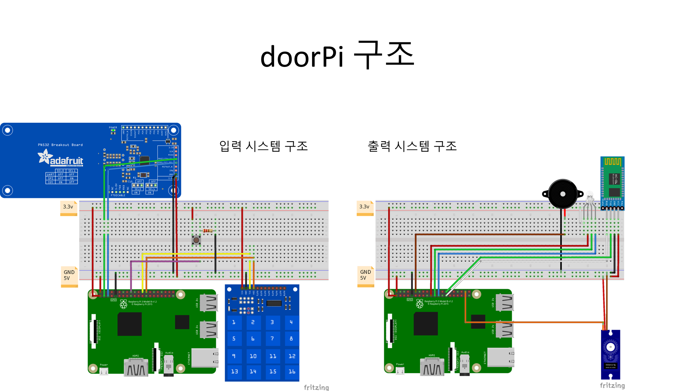
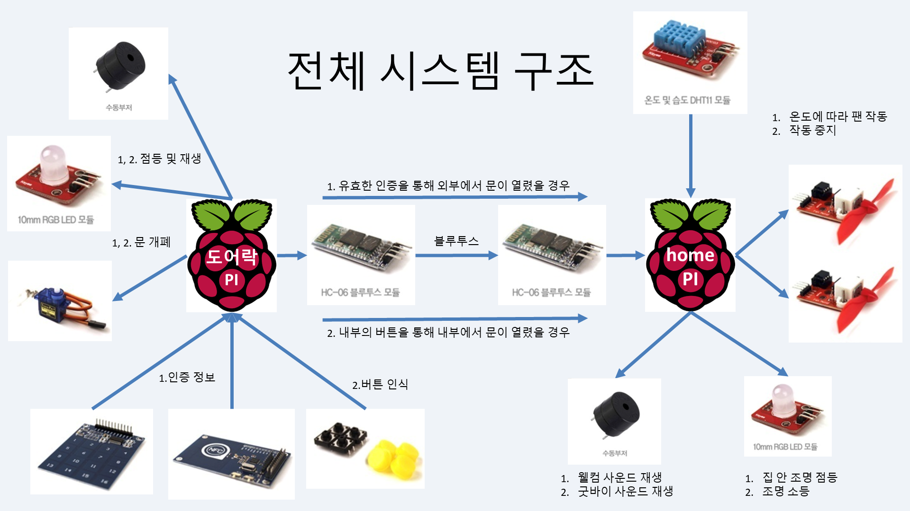
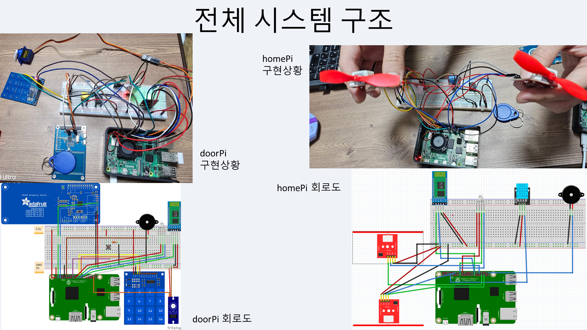
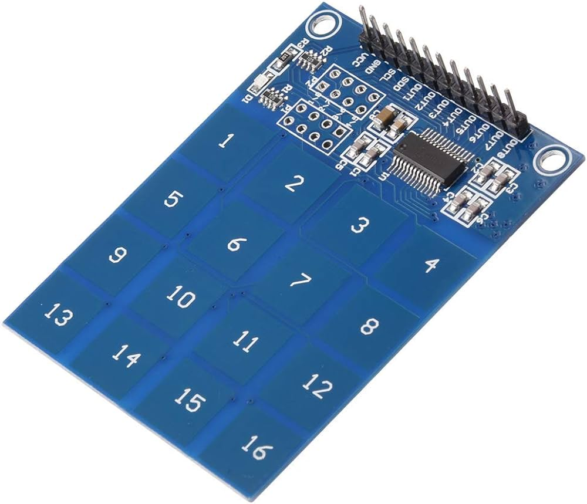
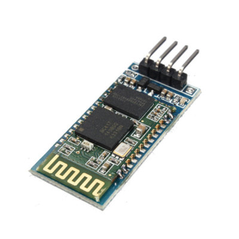
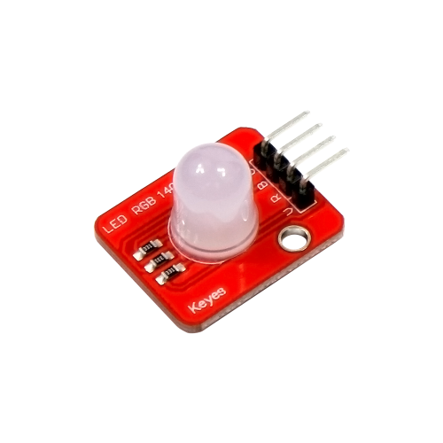
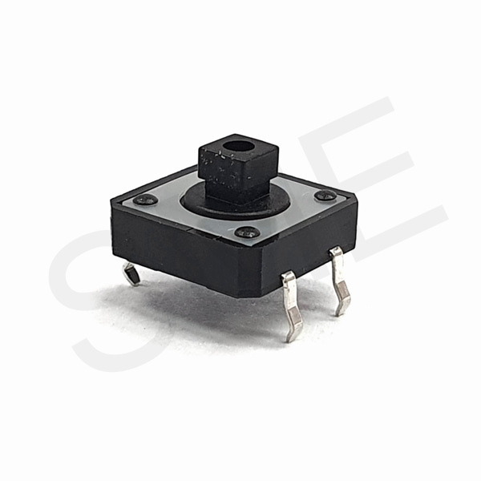
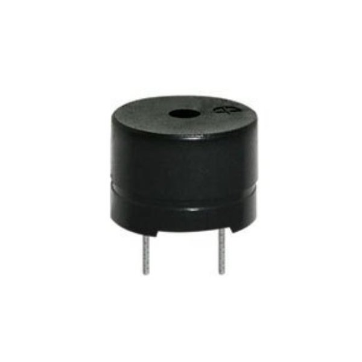
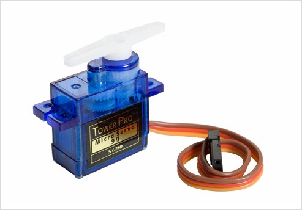
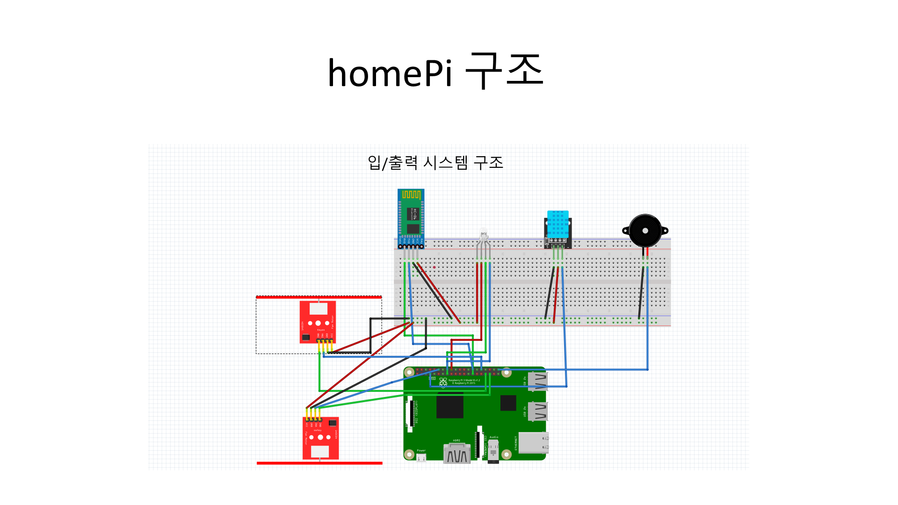

# 임베디드시스템 텀프로젝트 2팀

20180060 권수열

20180147 김민

20180405 문지혁

20210770 이강현

# doorPi

20180147 김민:           LED, NumPad, Button, Buzzer, Servo

20180405 문지혁:         NFC, Mutex, 리팩토링

20180060 권수열:         BT

# 개발배경

- 최근 1인 가구의 증가로 인해 현대 사회에서 편의성이 중요해지고 있습니다. 이에따라 라즈베리파이를 이용한 IOT 도어락/홈파이를 개발했습니다.
- 문이 열리고/닫힐때 각각의 액추에이터들이 스레드를 통해 동시에 작동되게하고, 꺼지게 한다.

# 구조도


# 주요 기능

- NFC 인증 문열림
- NumPad 인증 문열림
- Button 문열림
- 입력 시 비프음 출력
- 입력 시 상황에 따른 LED 출력
- 문열림 시 Servo 모터 작동
- Bluetooth 출입 상황 전달

# 프로젝트 구조설명

makefile을 이용하여 다중 파일 컴파일을 실행함

doorPi의 기본이 되는 main.c파일을 비롯한 소스코드 파일들은 src폴더에, 각 함수 및 헤더가 선언되어있는 헤더 파일은 include폴더에 작성되어있음

빌드할 시에 GitHub에는 올라가지 않는 build폴더를 이용하여 오브젝트 파일들을 생성, 다중 파일 컴파일을 실행함

# 전체 시스템 구조도



### 전체 회로 구조도


### 입력 회로 구조도


### 출력 회로 구조도


# 기능 상세 설명
### 1) 입실
1. NFC, NumPad 인증을 수행함, 성공 시 녹색, 실패 시 적색, NumPad 입력 시 청색을 LED로 출력하고 동시에 비프음을 출력함
2. 인증 성공 시 외부에서 출입함을 homePi에 Bluetooth로 전달함
3. Servo 모터를 작동시켜 잠금을 해제함
4. 몇초 동안 열림상태를 유지 후 다시 Servo 모터를 작동시켜 잠금
### 2) 퇴실
1. Button 입력 시 녹색 LED와 비프음을 출력함
2. 내부에서 출입함을 homePi에 Bluetooth로 전달함
3. Servo 모터를 작동시켜 잠금을 해제함
4. 몇초 동안 열림상태를 유지 후 다시 Servo 모터를 작동시켜 잠금

# 사용모듈



HW136 넘버패드 모듈 - 4x4 터치인식 숫자패드


PN532 NFC 모듈 - NFC 인식 패드 + NFC 칩



HC06 블루투스 모듈 - 시리얼 통신 블루투스 통신 모듈



CH3 RGB LED 모듈 - RGB LED 모듈



Button 모듈 - H형 버튼 모듈



Buzzer 모듈 - H형 버튼 모듈



Servo 모터 모듈 - 각도 조절 저회전 모터

# 실행방법

### ※ libnfc 라이브러리를 설치하여야함 (https://github.com/nfc-tools/libnfc) ※
1. 다음 명령어를 순서대로 입력하여 라이브러리를 사용하기 위한 패키지를 설치한다 :
```
sudo apt-get update

sudo apt-get install libusb-dev libpcsclite-dev i2c-tools
```

2. 패키지를 설치한 후 wget 명령어를 사용하여 libnfc 설치용 압축파일을 다운받아 압축을 해제한다:
```
cd ~

wget https://github.com/nfc-tools/libnfc/releases/download/libnfc-1.8.0/libnfc-1.8.0.tar.bz2

tar -xf libnfc-1.8.0.tar.bz2
```
3. 압축 해제된 libnfc 폴더로 이동하여 라이브러리를 설치해준다 :
```
cd libnfc-1.8.0

./configure --prefix=/usr --sysconfdir=/etc

make

sudo make install
```
4. nfc 장치파일 폴더에 libnfc.conf 파일을 생성해준다 :
```
cd /etc

sudo mkdir nfc

sudo vi /etc/nfc/libnfc.conf
```
5. libnfc.conf 파일에 다음 문장들을 추가한다 :
```
allow_autoscan = true

allow_intrusive_scan = false

log_level = 1

device.name = "_PN532_I2c"

device.connstring = "pn532_i2c:/dev/i2c-1"
```
6. nfc-list 명령을 수행했을 때 nfc 장치를 인식한다면 라이브러리를 사용할 준비가 끝난다.

### ※ 실행 ※
프로젝트 폴더로 이동하여 다음 명령어들을 실행한다 :
```
$ make

$ sudo ./doorPi
```
# 옵션

-lwiringPi

WiringPi 라이브러리를 이용하기 위한 옵션

-lnfc

nfc 라이브러리를 이용하기 위한 옵션

-I/usr/local/include/nfc

nfc 장치 파일을 불러오기 위한 옵션 (환경에 따라 다름)

-L/usr/local/lib

libnfc를 불러오기 위한 옵션

-lpthread

Pthread 라이브러리를 이용하기 위한 옵션


# homePi

20210770 이강현 : DHC-11, RGB-LED, BUZZER, DCMOTOR1,2

20180060 권수열 : BT

# 개발배경

- 최근 1인 가구의 증가로 인해 현대 사회에서 편의성이 중요해지고 있습니다. 이에따라 라즈베리파이를 이용한 IOT 도어락/홈파이를 개발했습니다.
- 문이 열리고/닫힐때 각각의 액추에이터들이 스레드를 통해 동시에 작동되게하고, 꺼지게 한다.

# 구조도


### 주요 기능
- 웰컴/굿바이 사운드 기능
  
1인 가구가 증가함에 따라 집안 분위기를 조성하는 것이 중요합니다. 따라서 도어락에서 문이 열릴때와 닫힐 때 홈파이에서 부저를 통해 웰컴/굿바이 사운드를 출력하여 적적한 분위기를 한결 나아지게 합니다.-
- 온도 측정 및 자동 냉난방 제어
  
문이 열릴 때 DHT-11 센서를 통해 실내 온도를 측정하여 온도에 따라서 냉/난방을 제어합니다. 이를 통해 에너지 소비를 최적화하고 편리함을 증진시킵니다.
- 자동 조명 제어
  
문이 열리고 닫힐 때 자동으로 LED 조명을 키고/끄는 기능을 도입하여 에너지 소비의 최적화와 편의성을 향상시켰습니다.

# 프로젝트 설명 및 구조

1. doorPi에서 키패드 혹은 NFC를 통해 문을열면, 블루투스 모듈을 통해 I/O (IN/OUT)라는 1바이트 크기의 데이터를 homePi에게 전달 합니다.
2. homePi는 블루투스를 통해 전달될 값을 대기하고있다가 I(IN) 혹은 O(OUT)값을 전달 받게 되면 각각의 작동을 하게됩니다.
3. 블루투스 모듈을 통해 homePi에 I(IN)이 들어왔을 경우에는 DHT-11(온습도 센서)와 LED(조명 역할), 부저(웰컴 사운드)가 스레드를 통해서 동시에 작동하게 됩니다.
4. DHT-11센서를 통해서 온도를 측정하고, 온도를 homePi에 전달하여 전달받은 값이 25도 이상일 경우에는 냉방 모터가, 25도 이하일 경우에는 난doo방 모터가 작동하게 됩니다.
5. 블루투스 모듈을 통해 homePi에 O(OUT)이 들어왔을 경우에는 냉/난방 모터, LED 가 작동을 정지하게 되고, 부저에서 굿바이 사운드가 출력하게 됩니다. 


## 하드웨어 구성
- doorPi


- homePi
 

- 전체 (doorPi+homePi)

 
# 사용모듈
- DHT-11 센서
- 수동 부저
- RGB_LED
- 블루투스 모듈
- DC 모터
- ㄴㅇㄹ

# 실행방법 

$ make

$./homePi

# 실행 동영상 
[](https://youtu.be/sgxC2jrwDj0?t=0s) 

# 간트 차트 

1. 초기 간트 차트


2. 실제 간트 차트


데모날짜가 미뤄짐에따라 코드개발에 조금더 신경을 쓸수 있었고, 오류해결 및 블루투스 연결 문제에 있어서 시간이 조금더 필요했기 때문에 기존 계획과는 조금 달라졌습니다.


